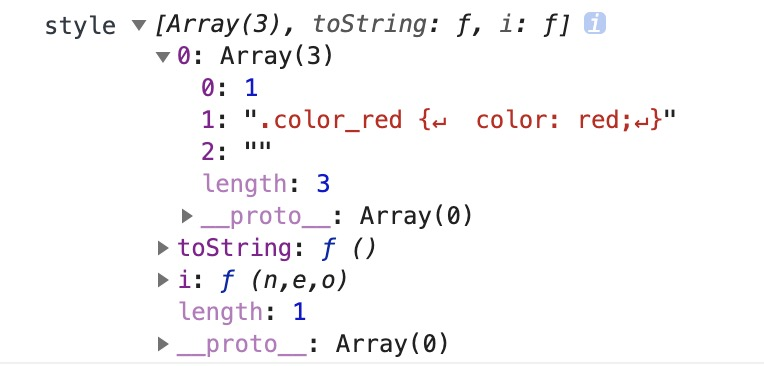
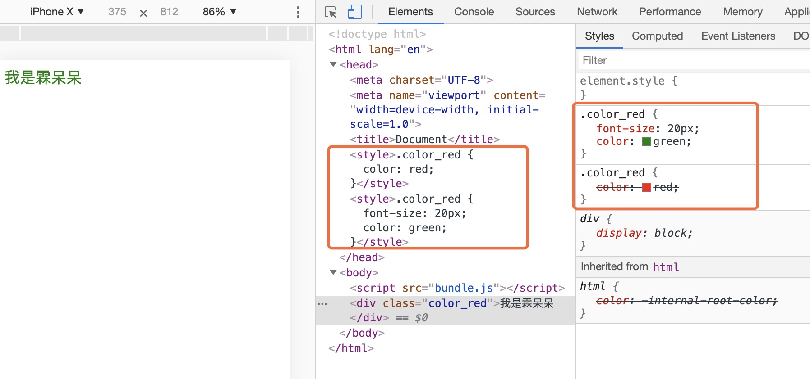

# 霖呆呆的webpack之路-基础篇

## webpack系列介绍

此系列记录了我在`webpack`上的学习历程。如果你也和我一样想要好好的掌握`webpack`,，那么我认为它对你是有一定帮助的，因为教材中是以一名`webpack`小白的身份进行讲解, 案例`demo`也都很详细, 涉及到：

- 基础篇(本章)
- 构建方式篇
- 优化篇
- loader篇
- 配置篇

建议先`mark`再花时间来看。

（其实这个系列在很早之前就写了，一直没有发出来，当时还写了一大长串前言可把我感动的，想看废话的可以点这里：[GitHub地址](https://github.com/LinDaiDai/webpack-document)，不过现在让我们正式开始学习吧）

所有文章`webpack`版本号`^4.41.5`, `webpack-cli`版本号`^3.3.10`。

在`webpack3`中，`webpack`本身和它的`CLI`都是在同一个包中，但在第4版中，两者分开来了，也是为了让我们更好地管理它们。

## 一、基本使用

先让我们来看看最基本的一种使用`webpack`的方式.

首先你得知道, `webpack`和其它依赖一样, 是包括**本地安装**和**全局安装**的, 但是在此我建议你使用本地安装的方式, **不推荐全局安装**.

因为使用了全局安装之后, 会使你的项目中的`webpack`锁定到指定版本中,并且在使用不同的` webpack` 版本的项目中,可能会导致构建失败.

所以在后面的教材中, 我都会以本地安装`webpack`的方式进行讲解.

**(教材中的案例GitHub地址: [LinDaiDai/webpack-basic](https://github.com/LinDaiDai/webpack-document/tree/master/webpack-example))**


### 1.1 初始化项目

首先我们创建一个目录, 并初始化`npm`:

```javascript
$ mkdir webpack-basic && cd webpack-basic
$ npm init -y
```

(使用`-y`初始化`npm`会帮助我们生成一个默认的`package.json`配置)


### 1.2 本地安装webpack

前面已经提到过, 文章采用的`webpack`版本号是`>4.0`的, 由于`webpack`与`webpack-cli`已经分开了, 我们需要分别安装它们(如果你使用的`webpack`版本号小于`4.0`则只需要安装`webpack`就可以了)

在`webpack-basic`的根目录下执行指令:

```
$ npm install webpack webpack-cli --save-dev
```

此时会发现`package.json`里的`devDependencies`中多出了你刚刚安装的`webpack`和`webpack-cli`.


### 1.3 创建bundle文件

完成以上步骤之后, 让我们来编写一个简单的页面来看看效果.

- 首先在根目录下创建一个`src`文件夹, 并在其中创建一个`index.js`文件

- 在根目录下创建一个`dist`文件夹, 并在其中创建一个`index.html`文件

之后, 项目结构就变成了这样:

```
 webpack-basic
 	|- package.json
 	|- /dist
 		|- index.html
 	|- /src
 		|- index.js
```

让我们在其中加上一些内容:

```javascript
// src/index.js
function component() {
    var element = document.createElement('div');

    element.innerHTML = "Hello Webpack";

    return element;
}

document.body.appendChild(component());
```

```html
<!--dist/index.html-->
<!DOCTYPE html>
<html lang="en">

<head>
    <meta charset="UTF-8">
    <meta name="viewport" content="width=device-width, initial-scale=1.0">
    <meta http-equiv="X-UA-Compatible" content="ie=edge">
    <title>webpack起步</title>
</head>

<body>
    <script src="main.js"></script>
</body>

</html>
```


`index.js`还好理解, 但是你可能会注意到`index.html`中引入了一个`main.js` , 但是这个`js`文件我们没有看到在哪里呀.

别急, 这里的`main.js`就是我们接下来要经过`webpack`打包之后生产的文件, 只不过在这里我们先提前引入进来了.


### 1.4 执行webpack打包

编写完以上代码之后, 我们就可以在根目录下使用此命令来进行打包了:

```
$ npx webpack
```

此时你会看到`dist`文件夹下就多出了一个`main.js`文件, 并且打开`index.html` , 会看到页面上显示了: "Hello Webpack".

可能你会有点糊了, 明明我们什么也没有配置, 它怎么就能够生成`main.js`呢.

像这种在`webpack4`没有任何`webpack`配置的情况下, `webpack`会为你提供一套默认的配置.

- 将`src/index.js`作为入口起点(也就是`entry`选项)
- 将`dist/main.js`作为输出(也就是`output`选项)

用官网的话来说就是:

> 执行 `npx webpack`，会将我们的脚本作为[入口起点](https://www.webpackjs.com/concepts/entry-points)，然后 [输出](https://www.webpackjs.com/concepts/output) 为 `main.js`。

Node 8.2+ 版本提供的 `npx` 命令，可以运行在初始安装的 webpack 包(package)的 webpack 二进制文件（`./node_modules/.bin/webpack`)


## 二、使用配置文件

通过上面👆的案例, 我们知道, 在`webpack4`中如果你没有任何配置文件时, 它会为你提供一套默认的配置.

但是在`webpack3`中, 这样是不允许的, 必须得有一个`webpack.config.js`文件来指定入口出口.

不过如果你是用`webpack4`开发的话, 在实际使用中,你也还是需要一个`webpack.config.js`文件来进行一些复杂的设置.

### 2.1 webpack.config.js

让我们在项目的根目录下创建一个叫`webpack.config.js`的文件, 并且在其中写上一些基本的配置: 

 ```javascript
// webpack.config.js
const path = require('path')

module.exports = {
	entry: './src/index.js',
	output: {
		filename: 'bundle.js',
		path: path.resolve(__dirname, 'dist')
	}
}
 ```

现在让我们重新使用命令来进行构建:

```javascript
$ npx webpack --config webpack.config.js

Hash: dabab1bac2b940c1462b
Version: webpack 4.0.1
Time: 328ms
Built at: 2018-2-26 22:47:43
    Asset      Size  Chunks             Chunk Names
bundle.js  69.6 KiB       0  [emitted]  main
Entrypoint main = bundle.js
   [1] (webpack)/buildin/module.js 519 bytes {0} [built]
   [2] (webpack)/buildin/global.js 509 bytes {0} [built]
   [3] ./src/index.js 256 bytes {0} [built]
    + 1 hidden module

WARNING in configuration(配置警告)
The 'mode' option has not been set. Set 'mode' option to 'development' or 'production' to enable defaults for this environment.('mode' 选项还未设置。将 'mode' 选项设置为 'development' 或 'production'，来启用环境默认值。)
```

可以看到, 这次它也成功的完成了构建, 不过相对于之前的执行语句, 我们多了一段:

```
--config webpack.config.js
```

其实这个命令的作用就是 **指定以哪个配置文件进行构建**, 比如我们这里就是指定了`webpack.config.js`这个文件.

不过其实在这里你也可以不要这段语句, 因为`webpack`命令默认会选择使用它.

只不过如果你的配置文件不叫`webapck.config.js`, 而是比如叫做`webpack.other.config.js`, 你就得指定它了.


现在, `webpack`根据你的配置, 入口处为`src/index.js`, 出口文件为`dist/bundle.js`.

我们也得重新修改一下`dist/index.html`的引入了:

```html
<script src="bundle.js"></script>
```


通过这种配置文件的方式, 让我们使用起来更加的灵活, 而且, 我们可以通过配置方式指定 loader 规则(loader rules)、插件(plugins)、解析选项(resolve options)，以及许多其他增强功能。


### 2.2 NPM脚本

在上面👆, 我们是使用`npx webpack`这样的`CLI`方式来运行本地的`webpack`的:

```
$ npx webpack
```

其实这样是不太方便的, 我们可以设置一个快捷方式. 在`package.json`中添加一个`npm`脚本:

```diff
{
    "name": "webpack-basic",
    "version": "1.0.0",
    "description": "",
    "private": true,
    "scripts": {
        "test": "echo \"Error: no test specified\" && exit 1",
+       "build": "webpack"
    },
    "keywords": [],
    "author": "",
    "license": "ISC",
    "devDependencies": {
        "webpack": "^4.41.5",
        "webpack-cli": "^3.3.10"
    },
    "dependencies": {
        "lodash": "^4.17.15"
    }
}
```

在`scripts`中新加了一个配置`"build: "webpack"`.

现在，可以使用 `npm run build` 命令，来替代我们之前使用的 `npx` 命令。

```
$ npm run build
```

现在用此命令工具执行出来的效果和上面👆介绍的是一样的.


## 三、管理资源

让我们来回顾一下上面👆讲解的项目目录:

```
 webpack-basic
 	|- package.json
 	|- webpack.config.js
 	|- /dist
 		|- index.html
 	|- /src
 		|- index.js
```

可以看到, 上面的案例只允许了我们使用`js`文件来进行构建, 但是在实际开发中, 我们不可能只有`js`文件, 若是我们要使用`css`、 图片、字体这些资源怎么办?

别担心, `webpack` 最出色的功能之一就是，除了 `JavaScript`，还可以通过 `loader` *引入任何其他类型的文件*。


### 3.1 加载CSS

首先让我们以加载`css`文件来认识一下`loader`.

#### style-loader和css-loader

为了从`js`模块中导入一个`css`文件, 比如你想在`index.js`中引入一个`css`文件:

```javascript
// index.js
import './style.css'

// 或者用require()的方式
const style = require('./style.css')
```

你需要在项目中(也就是`module`配置中), 安装并添加这两个`loader`:

- style-loader
- css-loader

```
$ npm i --save-dev style-loader css-loader
```

并且在`webpack.config.js`中进行配置:

```javascript
const path = require("path");

module.exports = {
  entry: "./src/index.js",
  output: {
    filename: "bundle.js",
    path: path.resolve(__dirname, "dist"),
  },
  module: {
    rules: [
      {
        test: /\.css$/,
        use: ["style-loader", "css-loader"],
      },
    ],
  },
};

```

我们在`webpack.config.js`中新增了一个`module`的配置.

这里配置的意思是: 

`webpack` 根据正则表达式，来确定应该查找哪些文件，并将其提供给指定的` loader`。`/.css$/`这个正则的意思就是匹配目录下所有以 `.css` 结尾的全部文件，都将被提供给 `style-loader` 和 `css-loader`。

(`$`应该知道什么意思吧，就是表示必须以什么结尾)

**注**⚠️:

`style-loader`要放到`css-loader`前面, 不然打包的时候就会报错了.


#### 在js中引入css

现在就可以在我们的项目中使用`css`了, 并且你可以在`js`中将它引入进来.

先让我们在`src`文件夹下创建一个`style.css` 文件并加上一些内容:

```css
.color_red {
    color: red;
}
```

然后修改我们之前的`src/index.js`文件, 给`element` 加上一个类名:

```javascript diff
import './style.css' // 1. 导入css文件

function component() {
    var element = document.createElement('div');

    element.innerHTML = _.join(['Hello', 'webpack'], ' ');
    element.classList.add('color_red') // 2. 添加类名
    return element;
}

document.body.appendChild(component());
```


此时重新使用命令语句进行构建:

```
$ npm run build
```

打开页面, 发现页面中的"Hello Webpack"变成了红色, 证明`css`引入成功了.

它这里实现的方式是: **当该模块运行时，含有 CSS 字符串的标签，将被插入到 `html` 文件的 `head` 中。**

所以如果我们检查页面(也就是打开控制台), 然后在`Elements`中你会发现, `head`里会加上一个`style`标签, 里面就是你定义`css`的内容.


#### 单独使用css-loader有什么效果？

虽然上面👆我们介绍要想在页面中使用`css`就需要使用`style-loader`和`css-loader`这两个`loader`，那么它们单独的作用是什么呢？

现在我们修改一下`webpack.config.js`的配置，去除掉`style-loader`：

```diff
const path = require("path");

module.exports = {
  entry: "./src/index.js",
  output: {
    filename: "bundle.js",
    path: path.resolve(__dirname, "dist"),
  },
  module: {
    rules: [
      {
        test: /\.css$/,
        use: [
-           "style-loader", 
            "css-loader"
        ],
      },
    ],
  },
};
```

并且把`index.js`那里引入的`style`打印出来看看：

```javascript
// src/index.js
const style = require('./style.css')
console.log('style', style)
```

效果：



可以发现，`css-loader`它的作用实际就是能识别导入的`css`这个模块，并通过特定的语法规则进行内容转换。

但是这里得到的是一个数组啊，并不是我们想要的，页面也无法来使用它。所以这时候就需要配合上`style-loader`它才能发挥它真正的作用。


#### style-loader的作用

`style-loader`它的原理其实就是通过一个JS脚本创建一个`style`标签，里面会包含一些样式。并且它是不能单独使用的，因为它并不负责解析`css`之前的依赖关系。

也就是说：

- 单独使用了`css-loader`只能保证我们能引用`css`模块进来，但是并没有效果
- 而`style-loader`就可以创建一个`style`标签，并且把引入进来的`css`样式都塞到这个标签里

但是有一点需要注意了，我们在当前项目的`js`中引入了几个`css`模块，它就会生成几个`style`标签。

比如现在我在项目中又新建了一个`style2.css`文件并加上一些样式：

```javascript
.color_red {
  font-size: 20px;
  color: green;
}
```

然后在`src/index.js`都引入这两个`css`文件：

```javascript
import './style.css'
import './style2.css'
```

（记得把`webpack.config.js`中的`style-loader`重新加上）

此时重新`npm run build`一下，并打开页面：



现在你会发现`"霖呆呆"`他变绿了。（当然是选择原谅她了...）

页面中确实是生成了两个`style`标签，而且样式的显示规则也是后面的覆盖前面的(`style2.css`比`style.css`晚引入)


### 3.2 加载图片

我们已经介绍了如何加载 `css`, 那么项目中的图片是如何处理的呢?

#### file-loader

使用`file-loader`可以让我们在`js`和`css`中引入一些静态资源, 同样的, 你要先安装配置它:

```jade
$ npm i --save-dev file-loader
```

配置`webpack.config.js`:

```javascript
const path = require('path')

module.exports = {
    entry: './src/index.js',
    output: {
        filename: 'bundle.js',
        path: path.resolve(__dirname, 'dist')
    },
    module: {
        rules: [{
                test: /\.css$/,
                use: [
                    "style-loader",
                    "css-loader"
                ]
            },
            {
                test: /\.(png|svg|jpg|gif)$/,
                use: [
                    'file-loader'
                ]
            }
        ]
    }
}
```

可以看到, 我在原来的`rules`数组中又新增了一个配置, 有了`css-loader`的基础, 相信这里 你也很快就看懂了.

#### 在js/css中引入图片

接下来, 就让我们看看在项目里使用图片的效果吧.

首先我在`src`目录下放了一张图片: `icon.png`.

然后分别在`index.js`和`style.css`中引入它:

```javascript
// index.js
import './style.css'
import Icon from './icon.png' // 1. 引入图片

function component() {
    var element = document.createElement('div');

    element.innerHTML = '霖呆呆';
    element.classList.add('color_red')

    var img = new Image(200, 200); // 2. 使用图片
    img.src = Icon;
    element.appendChild(img);

    return element;
}

document.body.appendChild(component());
```

```css
/* style.css */
.color_red {
    color: red;
    background: url('./icon.png');
  	height: 300px;
}
```

重新打包, 然后查看页面, 可以看到图片在两个地方都可以正常引用了.


此时细心的你可能会发现, 在打包完的`dist`文件夹里, 会出现一个以MD5哈希值命名的`png`文件:

```
webpack-basic
	|- /dist
		|- 182ba2a0f5c9507387abe2ad84c23e6b.png
		|- bundle.js
		|- index.html
```

没错, 当你在`js`或者`css`中引入这个图片的时候, 该图片会被处理并添加到`output`目录下.

有意思的是, 如果你去掉`index.js`和`style.css` 中对`icon.png`的引用的话, 则`webpack`打包完之后的`dist`文件夹内就不会有这张图片。


#### file-loader的其它可选参数

在上面👆我们只是简单的使用了一下`file-loader`:

```javascript
rules: [
  {
    test: /\.(png|svg|jpg|gif)$/,
    use: ["file-loader"],
  },
],
```

其实, `file-loader`还有很多其它的参数.

比如指定打包完之后文件的命名规则、打包完之后存放的目录等等.

这些配置规则都可以放在`options`这个对象中:

```javascript
rules: [
	{
		test: /\.(png|svg|jpg|gif)$/,
		use: [
			{
				loader: 'file-loader',
				options: {}
			}
		]
	}
]
```

而`options`的选项都有例如`name、context、publicPath、outputPath`等等, 具体可以查看:
[file-loader](https://www.webpackjs.com/loaders/file-loader/)

我这里演示一下, 将**打包之后的图片存放到images文件夹下, 并且命名为图片的原始名称**:

```javascript
rules: [
	{
		test: /\.(png|svg|jpg|gif)$/,
		use: [
			{
				loader: 'file-loader',
				options: {
					name: '[name].[ext]',
					outputPath: 'images/'
				}
			}
		]
	}
]
```

此时, 打包完之后的目录结构就会变成:

```
webpack-basic
	|- /dist
		|- /images
			|- icon.png
		|- bundle.js
		|- index.html
```

`name`的`[name]`表示使用文件的原始名称, `[ext]`表示文件的原始类型, `[hash]`表示以哈希值命名, `[path]`表示资源相对于`context`的路径.

(`context` 默认为`webpack.config.js`)


### 3.3 加载字体

上面👆我们已经学会了如何加载图片, 那么加载字体呢?

其实字体也是一种资源, 所以它的加载方式和图片是一样的, 也是使用`file-loader`.

只不过在`webpack`中的配置需要你针对一下字体后缀的文件做下处理:

**webpack.config.js**

```javascript
rules: [
  {
    test: /\.(woff|woff2|eot|ttf|otf)$/,
    use: ["file-loader"],
  },
]
```


OK, 让我们在项目里引用一下字体, 在`src/`下新建一个`fonts`文件夹, 并添加两个字体文件, 此时项目目录变成:

（这两个字体文件是我从[Iconfont的在线字体](https://www.iconfont.cn/webfont?spm=a313x.7781069.1998910419.12&puhui=1#!/webfont/index)上下载下来的）

```diff
 webpack-basic
 	|- package.json
 	|- webpack.config.js
 	|- /dist
 		|- index.html
 	|- /src
 		|- fonts
+ 		|- webfont.woff
+			|- webfont.woff2
		|- icon.png
 		|- index.js
```

在`css`中引用它:

```css
@font-face {
    font-family: 'MyFont';
    src: url('./fonts/webfont.woff2') format('woff2'), url('./fonts/webfont.woff') format('woff');
    font-weight: 600;
    font-style: normal;
}

.color_red {
    color: red;
    font-family: 'MyFont';
    background: url('./icon.png');
}
```

然后修改一下`src/index.js`中的字：

```javascript
// src/index.js
function createElement () {
	element.innerHTML = '孔子曰：中午不睡，下午崩溃!孟子曰：孔子说的对!';
}
```

(注意了，案例中我是偷了下懒，直接使用[Iconfont的在线字体](https://www.iconfont.cn/webfont?spm=a313x.7781069.1998910419.12&puhui=1#!/webfont/index)写的，它只针对于`"孔子曰：中午不睡，下午崩溃!孟子曰：孔子说的对!"`这几个字有效，换成其它字就不行了，当然实际使用上你肯定不能这么干)

重新打包后打开页面, 可以看到刚刚引入的字体.

它和图片一样, 如果没用到字体的话, 也不会被输出到`output`里.


### 3.4 加载xml或csv数据

除了上述介绍的`css`, 图片, 字体之外, 可以加载的可用资源还可以是数据, 比如: `JSON、CSV、TSV、XML`.

- 内置是支持`JSON`文件的, 比如`import Data from './data.json'`默认是正常运行的
- `CSV和TSV`文件需要使用`csv-loader`
- `XML`文件需要使用`xml-loader`

所以你如果要使用的话, 先安装:

```
$ npm i --save-dev csv-loader xml-loader
```

然后在`webpack.config.js`中配置:

```javascript
rules: [
  {
    test: /\.(csv|tsv)$/,
    use: ["csv-loader"],
  },
  {
    test: /\.xml$/,
    use: ["xml-loader"],
  },
]
```

现在你就可以直接在项目里引用`xml`文件了:

```javascript
import Data from './data.xml'
```


### 3.5 加载txt文本数据

加载`.txt`文本数据依靠`raw-loader`.

```
$ npm i --save-dev raw-loader
```

然后配置:

```javascript
rules: [
  {
    test: /\.(csv|tsv)$/,
    use: ["csv-loader"],
  },
  {
    test: /\.txt$/,
    use: "raw-loader",
  },
],
```

此时引用`.txt`文件就可以获取它里面的内容了:

```javascript
import txt from './assets/file.txt'

export function print() {
    console.log(txt) // 我是一段测试raw-loader的文本内容
}
```

如果你使用`file-loader`来处理`txt`文件的话, 会将`txt`文件压缩到bundle中,而且只能获取到文件的路径:

```javascript
import txt from './assets/file.txt'

export function print() {
    console.log(txt) // 1474623111aaae6b31c08e1fedda68a3.txt
}
```


## 四、管理输出

### 4.1 多个输入/输出

上面👆的案例, 我们只有一个输入`src/index.js`和一个输出`dist/bundle.js`.

其实`entry`和`output`是支持你有多个输入、输出的.

我重新创建了一个项目`webpack-html`. 并依照之前的配置, 只引入了`webpack 和 webpack-cli`

然后在`src`下创建`index.js`和`print.js`:

**src/print.js**:

```javascript
export default function printMe() {
    console.log("I' m printMe");
}
```

**src/index.js**:

```javascript
import printMe from './print.js';

function component() {
    var element = document.createElement('div');
    element.innerHTML = 'Hello Webpack';

    var btn = document.createElement('button');
    btn.innerHTML = '点击我';
    btn.onclick = printMe;
    element.appendChild(btn);

    return element;
}

document.body.appendChild(component());
```

此时的项目结构为:

```
webpack-html
	|- package.json
	|- webpack.config.js
	|- /src
		|- index.js
		|- print.js
```

然后配置一下`webpack.config.js`文件:

```javascript
const path = require('path')

module.exports = {
    entry: {
        app: './src/index.js',
        print: './src/print.js'
    },
  	output: {
        filename: '[name].bundle.js',
        path: path.resolve(__dirname, 'dist')
    }
}
```

此时, 我配置了两个输入`index.js`和`print.js`.

而输出的话, 我采用的是`[name].bundle.js`的形式, 这样在打包完毕之后, 就会生成以下格式的文件:

```
/dist
	|- app.bundle.js
	|- print.bundle.js
```

在`dist`这个文件夹下有`app.bundle.js`和`print.bundle.js`.

所以你应该能够理解了吧, `[name]` 对应的就是`entery`处.


接着让我们再在`dist`文件夹下新建一个`index.html`文件并引入刚刚生成的那两个`js`文件:

**dist/index.html**:

```html
<!DOCTYPE html>
<html>
  <head>
    <meta charset="UTF-8">
    <title>Webpack Output Management</title>
  </head>
  <body>
  <script src="app.bundle.js"></script>
  <script src="print.bundle.js"></script></body>
</html>
```

然后让我们打开这个`html`看看效果, 页面中显示了 "Hello Webpack", 并且点击按钮的时候, 也会有`console.log`.

证明了刚刚输出的两个`js`文件引入的都没有问题.


### 4.2 设定HtmlWebpackPlugin

在上面👆所有的案例中, 我们采用的都是手动建立一个`index.html`, 然后将输出的`js`文件引入这个`html`.

其实有一个插件是能让我们免去这一步, 这就是`html-webpack-plugin`

#### 基本使用

首先让我们安装它:

```
$ npm i --save-dev html-webpack-plugin
```

然后重新调整`webpack.config.js`:

```diff
const path = require('path')
+ const HtmlWebpackPlugin = require('html-webpack-plugin')

module.exports = {
    entry: {
        app: './src/index.js',
        print: './src/print.js'
    },
+    plugins: [
+        new HtmlWebpackPlugin({
+            title: 'Webpack Output Management'
+        })
+    ],
    output: {
        filename: '[name].bundle.js',
        path: path.resolve(__dirname, 'dist')
    }
}
```

现在让我们删掉之前手动创建的`index.html`, 然后执行`npm run build`看看.

OK👌, 它现在已经会自动在`dist`文件夹下生成`index.html`, 而且还会帮我们把输出的`js`都引入进去:

```html
<!DOCTYPE html>
<html>
  <head>
    <meta charset="UTF-8">
    <title>Webpack Output Management</title>
  </head>
  <body>
  <script type="text/javascript" src="app.bundle.js"></script>
  <script type="text/javascript" src="print.bundle.js"></script></body>
</html>
```

#### 其它配置项

在`HtmlWebpackPlugin`里, 除了`title`(配置产生的`index.html`的标题)这个配置项外, 还有很多其它的选项.

比如:

- filename {String } 默认为 `index.html`, 这个是指定你生成的`index.html`的路径和名称;
- template { String } 默认为 '', 有时候你想要自己写生成的`index.html`文件, 这个属性就是指定你的模版路径的.
- favion {String} 指定你生成`index.html`的图标, 当然如果你使用了`template`, 这个属性也可以不用了

这里我来演示一下使用`filename`和`template`看看会有什么效果 😊.

首先我在`src`下面新建了一个`index.html`, 这个用来写模版:

**src/index.html**:

```html
<!DOCTYPE html>
<html lang="en">

<head>
    <meta charset="UTF-8" />
    <meta name="viewport" content="width=device-width, initial-scale=1.0" />
    <meta http-equiv="X-UA-Compatible" content="ie=edge" />
    <title>
        <%= htmlWebpackPlugin.options.title %>
    </title>
</head>

<body></body>

</html>
```

然后修改一下`webpack.config.js`:

```diff
const path = require("path");
const HtmlWebpackPlugin = require("html-webpack-plugin");

module.exports = {
  entry: {
    app: "./src/index.js",
    print: "./src/print.js",
  },
  plugins: [
    new HtmlWebpackPlugin({
      title: "Webpack Output Management",
+      filename: "admin.html",
+      template: "src/index.html",
    }),
  ],
  output: {
    filename: "[name].bundle.js",
    path: path.resolve(__dirname, "dist"),
  },
};
```

现在执行打包指令之后, 生成的`dist`文件目录就会变成:

```diff
/dist
+ |- admin.html
	|- app.bundle.js
	|- print.bundle.js
-	|- index.html
```


### 4.3 清理/dist文件夹

我们在每次构建之后, 都会生成`dist`文件夹, 但是如果有历史遗留下来的文件的话, 它不会自动的清理掉.

现在比较推荐的做法就是在每次构建前清理`/dist`文件夹, `clean-webpack-plugin`插件就是用来做这个事的.

```
$ npm i --save-dev clean-webpack-plugin
```

然后在`webpack.config.js`配置一下:

```diff
const path = require("path");
const HtmlWebpackPlugin = require("html-webpack-plugin");
+ const { CleanWebpackPlugin } = require("clean-webpack-plugin");

module.exports = {
  entry: {
    app: "./src/index.js",
    print: "./src/print.js",
  },
  plugins: [
+   new CleanWebpackPlugin({
+       cleanAfterEveryBuildPatterns: ["dist"], // 这个是非必填的
+   }),
    new HtmlWebpackPlugin({
      title: "Webpack Output Management",
      filename: "assets/admin.html",
      template: "src/index.html",
    }),
  ],
  output: {
    filename: "[name].bundle.js",
    path: path.resolve(__dirname, "dist"),
  },
};
```

若你是按照官网的安装方式:

```javascript
const CleanWebpackPlugin = require('clean-webpack-plugin');
...
new CleanWebpackPlugin(['dist'])
```

然后你在打包的时候就会报错:

```
TypeError: CleanWebpackPlugin is not a constructor
```

这个我查明了原因, 如果你安装的`clean-webpack-plugin`是`3.0` 以上的话, 你就得像我一样用`const { CleanWebpackPlugin } = require('clean-webpack-plugin')`这样的方式引用. 

并且配置要清理的文件夹也要用`cleanAfterEveryBuildPatterns`来定义.

