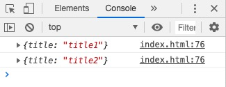
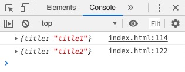
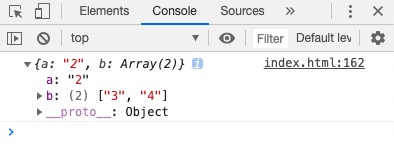

## JSONP

### 基本原理

基本原理： 主要就是利用了 `script` 标签的`src`没有跨域限制来完成的。


### 执行过程

执行过程：

- 前端定义一个解析函数(如: `jsonpCallback = function (res) {}`)
- 通过`params`的形式包装`script`标签的请求参数，并且声明执行函数(如`cb=jsonpCallback`)
- 后端获取到前端声明的执行函数(`jsonpCallback`)，并以带上参数且调用执行函数的方式传递给前端
- 前端在`script`标签返回资源的时候就会去执行`jsonpCallback`并通过回调函数的方式拿到数据了。


### 优缺点

缺点：

- 只能进行`GET`请求

优点：

- 兼容性好，在一些古老的浏览器中都可以运行


### 案例分析

先来看看我们要实现一个什么效果：

在一个叫`index.html`的文件中有以下代码：

```html
<script type='text/javascript'>
    window.jsonpCallback = function (res) {
        console.log(res)
    }
</script>
<script src='http://localhost:8080/api/jsonp?id=1&cb=jsonpCallback' type='text/javascript'></script>
```

然后我本地有一个文件`server.js`它会使用`node`提供一个服务，来模拟服务器。

并且定义一个接口`/api/jsonp`来查询`id`对应的数据。

当我打开`index.html`的时候就会加载`script`标签，并执行了此次跨域请求。


#### 前期准备

- 我在本地新建一个文件夹`node-cors`
- 并在此目录下`npm init`，初始化`package.json`
- 安装`koa`(`node`的一个轻量级框架)
- 新建文件夹`jsonp`，并新建`index.html`和`server.js`，一个写前端代码，一个写后端

```
mkdir node-cors && cd node-cors
npm init
cnpm i --save-dev koa
mkdir jsonp && cd jsonp
touch index.html
touch server.js
```


#### 后端代码

由于`JSONP`的实现需要前后端配合，先来写一下后端的实现：

（看不懂没关系，下面的**前端简单实现**会做解释）

```javascript
const Koa = require('koa');
const app = new Koa();
const items = [{ id: 1, title: 'title1' }, { id: 2, title: 'title2' }]

app.use(async (ctx, next) => {
  if (ctx.path === '/api/jsonp') {
    const { cb, id } = ctx.query;
    const title = items.find(item => item.id == id)['title']
    ctx.body = `${cb}(${JSON.stringify({title})})`;
    return;
  }
})
console.log('listen 8080...')
app.listen(8080);
```

写完之后，保存。

并在`jsonp`这个文件夹下执行：

```
node server.js
```

来启动服务，可以看到编辑器的控制台中会打印出`"listen 8080..."`


#### 前端简单实现

OK👌，后端已经实现了，现在让我们来看看前端最简单的一种实现方式，也就是写死一个`script`并发送请求：

`index.html`中：

```html
<script type='text/javascript'>
    window.jsonpCallback = function (res) {
        console.log(res)
    }
</script>
<script src='http://localhost:8080/api/jsonp?id=1&cb=jsonpCallback' type='text/javascript'></script>
```

这两个`script`的意思是：

- 第一个，创建一个`jsonpCallback`函数。但是它还没有被调用
- 第二个，加载`src`中的资源，并等待请求的内容返回

整个过程就是：

1. 当执行到第二个`script`的时候，由于请求了我们的`8080`端口，并且把`id`和`cb`这两个参数放到`URL`里。那么后台就可以拿到`URL`里的这两个参数。
2. 也就是在**后端代码**中的`const { id, cb } = ctx.query`这里获取到了。

3. 那么后端在拿到这两个参数之后，可能就会根据`id`来进行一些查询，当然，我这里只是模拟的查询，用了一个简单的`find`来进行一个查找。查找到`id`为`1`的那项并且取`title`。

4. 第二个参数`cb`，拿到的就是`"jsonpCallback"`了，这里也就是告诉后端，前端那里是会有一个叫做`jsonpCallback`的函数来接收后端想要返回的数据，而后端你只需要在返回体中写入`jsonpCallback()`就可以了。
5. 前端在得到了后端返回的内容`jsonpCallback({"title":"title1"})`，发现里面是一段执行函数的语句，因此就会去执行第一个`script`中的`jsonpCallback`方法了，并且又是带了参数的，所以此时浏览器控制台会打印出`{ title: 'title1' }`

以此来达到一个简单的跨域的效果。

其实你想想，如果我们把第二个`script`标签换成以下代码，是不是也能达到同样的效果呢？

```html
<!-- <script src='http://localhost:8080/api/jsonp?id=1&cb=jsonpCallback' type='text/javascript'></script> -->
<script type="text/javascript">
    jsonpCallback({ title: 'title1' })
</script>
```


#### jQuery中ajax实现

上面👆我们介绍了用`script`标签来实现，在`jQuery`的`$.ajax()`方法其实也提供了`jsonp`。

让我们一起来看看：

```html
<script src="https://cdn.bootcss.com/jquery/3.5.0/jquery.min.js"></script>
<script>
    $.ajax({
        url: "http://localhost:8080/api/jsonp",
        dataType: "jsonp",
        type: "get",
        data: {
            id: 1
        },
        jsonp: "cb",
        success: function (data) {
            console.log(data);
        }
    });
</script>
```

在`success`回调中同样可以拿到数据。


### 封装一个JSONP方法

（此章会一步一步教你如何封装一个比较完美的`JSONP`方法）

#### 简易版

先看下我们要实现的功能

定义一个`JSONP`方法，它接收四个参数：

- url
- params
- callbackKey：与后台约定的回调函数是用哪个字段(如`cb`)
- callback：拿到数据之后执行的回调函数

```html
<script>
    function JSONP({
        url,
        params = {},
        callbackKey = 'cb',
        callback
    }) {
        // 定义本地的一个callback的名称
        const callbackName = 'jsonpCallback';
        // 把这个名称加入到参数中: 'cb=jsonpCallback'
        params[callbackKey] = callbackName;
        //  把这个callback加入到window对象中，这样就能执行这个回调了
        window[callbackName] = callback;

        // 得到'id=1&cb=jsonpCallback'
        const paramString = Object.keys(params).map(key => {
            return `${key}=${params[key]}`
        }).join('&')
        // 创建 script 标签
        const script = document.createElement('script');
        script.setAttribute('src', `${url}?${paramString}`);
        document.body.appendChild(script);
    }
    JSONP({
        url: 'http://localhost:8080/api/jsonp',
        params: { id: 1 },
        callbackKey: 'cb',
        callback (res) {
            console.log(res)
        }
    })
</script>
```

这样写打开页面也可是可以看到效果的。


#### 同时多个请求

上面我们虽然实现了`JSONP`，但有一个问题，那就是如果我同时多次调用`JSONP`：

```javascript
JSONP({
    url: 'http://localhost:8080/api/jsonp',
    params: { id: 1 },
    callbackKey: 'cb',
    callback (res) {
        console.log(res) // No.1
    }
})
JSONP({
    url: 'http://localhost:8080/api/jsonp',
    params: { id: 2 },
    callbackKey: 'cb',
    callback (res) {
        console.log(res) // No.2
    }
})
```

可以看到这里我调用了两次`JSONP`，只是传递的参数不同。但是并不会按我们预期的在`No.1和No.2`中分别打印，而是都会在`No.2`中打印出结果。这是因为后面一个`callback`把`JSONP`里封装的第一个`callback`给覆盖了，它们都是共用的同一个`callbackName`，也就是`jsonpCallback`。如下所示：



两次结果都是从`76`行打印出来的。

所以我们得改造一下上面的`JSONP`方法：

- 让`callbackName`是一个唯一的，可以使用递增
- 不要把回调定义在`window`中这样会污染全局变量，可以把它扔到`JSON.xxx`中

OK👌，来看看改造之后的代码：

```html
<script>
    function JSONP({
        url,
        params = {},
        callbackKey = 'cb',
        callback
    }) {
        // 定义本地的唯一callbackId，若是没有的话则初始化为1
        JSONP.callbackId = JSONP.callbackId || 1;
        let callbackId = JSONP.callbackId;
        // 把要执行的回调加入到JSON对象中，避免污染window
        JSONP.callbacks = JSONP.callbacks || [];
        JSONP.callbacks[callbackId] = callback;
        // 把这个名称加入到参数中: 'cb=JSONP.callbacks[1]'
        params[callbackKey] = `JSONP.callbacks[${callbackId}]`;

        // 得到'id=1&cb=JSONP.callbacks[1]'
        const paramString = Object.keys(params).map(key => {
            return `${key}=${params[key]}`
        }).join('&')
        // 创建 script 标签
        const script = document.createElement('script');
        script.setAttribute('src', `${url}?${paramString}`);
        document.body.appendChild(script);
        // id自增，保证唯一
        JSONP.callbackId++;
    }
    JSONP({
        url: 'http://localhost:8080/api/jsonp',
        params: { id: 1 },
        callbackKey: 'cb',
        callback (res) {
            console.log(res)
        }
    })
    JSONP({
        url: 'http://localhost:8080/api/jsonp',
        params: { id: 2 },
        callbackKey: 'cb',
        callback (res) {
            console.log(res)
        }
    })
</script>
```

可以看到现在调用了两次回调，但是会分别执行`JSONP.callbacks[1]`和`JSONP.callbacks[2]`：




#### 最终版JSONP方法

其实上面已经算比较完美了，但是还会有一个小问题，比如下面这种情况：

我改一下后端的代码

```javascript
const Koa = require('koa');
const app = new Koa();
const items = [{ id: 1, title: 'title1' }, { id: 2, title: 'title2' }]

app.use(async (ctx, next) => {
  if (ctx.path === '/api/jsonp') {
    const { cb, id } = ctx.query;
    const title = items.find(item => item.id == id)['title']
    ctx.body = `${cb}(${JSON.stringify({title})})`;
    return;
  }
  if (ctx.path === '/api/jsonps') {
    const { cb, a, b } = ctx.query;
    ctx.body = `${cb}(${JSON.stringify({ a, b })})`;
    return;
  }
})
console.log('listen 8080...')
app.listen(8080);
```

增加了一个`/api/jsonps`的接口。

然后前端代码增加了一个这样的请求：

```javascript
JSONP({
    url: 'http://localhost:8080/api/jsonps',
    params: {
        a: '2&b=3',
        b: '4'
    },
    callbackKey: 'cb',
    callback (res) {
        console.log(res)
    }
})
```

可以看到，参数的`a`中也会有`b`这个字符串，这样就导致我们获取到的数据不对了：



后台并不知道`a`的参数是一个字符串，它只会按照`&`来截取参数。

所以为了解决这个问题，可以使用**URI编码**。

也就是使用：

```javascript
encodeURIComponent('2&b=3')

// 结果为
"2%26b%3D3"
```

只需要改一下`JSONP`方法中参数的生成：

```javascript
// 得到'id=1&cb=JSONP.callbacks[1]'
const paramString = Object.keys(params).map(key => {
    return `${key}=${encodeURIComponent(params[key])}`
}).join('&')
```


来看一下完整版的`JSONP`方法：

```html
<script>
    function JSONP({
        url,
        params = {},
        callbackKey = 'cb',
        callback
    }) {
        // 定义本地的唯一callbackId，若是没有的话则初始化为1
        JSONP.callbackId = JSONP.callbackId || 1;
        let callbackId = JSONP.callbackId;
        // 把要执行的回调加入到JSON对象中，避免污染window
        JSONP.callbacks = JSONP.callbacks || [];
        JSONP.callbacks[callbackId] = callback;
        // 把这个名称加入到参数中: 'cb=JSONP.callbacks[1]'
        params[callbackKey] = `JSONP.callbacks[${callbackId}]`;
        // 得到'id=1&cb=JSONP.callbacks[1]'
        const paramString = Object.keys(params).map(key => {
            return `${key}=${encodeURIComponent(params[key])}`
        }).join('&')
        // 创建 script 标签
        const script = document.createElement('script');
        script.setAttribute('src', `${url}?${paramString}`);
        document.body.appendChild(script);
        // id自增，保证唯一
        JSONP.callbackId++;

    }
    JSONP({
        url: 'http://localhost:8080/api/jsonps',
        params: {
            a: '2&b=3',
            b: '4'
        },
        callbackKey: 'cb',
        callback (res) {
            console.log(res)
        }
    })
    JSONP({
        url: 'http://localhost:8080/api/jsonp',
        params: {
            id: 1
        },
        callbackKey: 'cb',
        callback (res) {
            console.log(res)
        }
    })
</script>
```


注意⚠️：

`encodeURI`和`encodeURIComponent`的区别：

- `encodeURI()`不会对本身属于URI的特殊字符进行编码，例如冒号、正斜杠、问号和井字号；
- 而`encodeURIComponent()`则会对它发现的任何非标准字符进行编码

例如：

```javascript
var url = 'https://lindaidai.wang'

encodeURI(url) // "https://lindaidai.wang"

encodeURIComponent(url) // "https%3A%2F%2Flindaidai.wang"
```

另外，可以使用`decodeURIComponent`来解码。

```javascript
decodeURIComponent("https%3A%2F%2Flindaidai.wang")
// 'https://lindaidai.wang'
```


### 参考文章

- [JSONP的实现](https://juejin.im/entry/57d11f5967f3560057c3f785)

